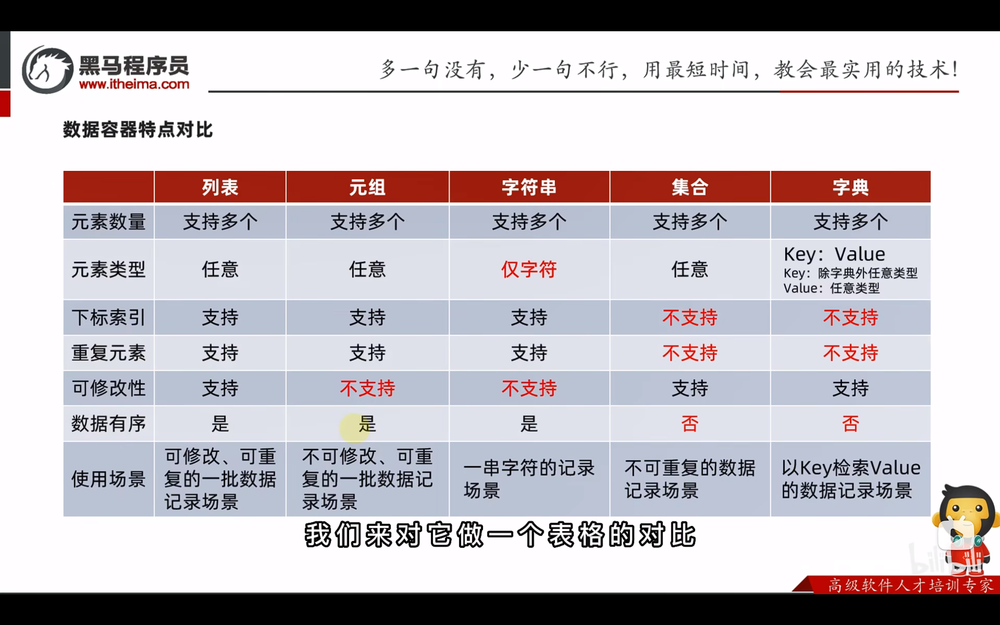

#### 数据容器

&emsp; 数据容器是：一种可以 **容纳多份数据** 的 **数据类型** ，容纳的一份数据称之为1个元素，每一个元素可以是任意的数据类型。例如：字符串、数字、布尔类型等。

&emsp; 数据容器内的每一份数据，称之为 **`元素`** 。

根据容器的不同特点：

- 是否支持重复元素
- 是否可以修改

- 是否有序

**. . . . . . **

数据容器分类：

- 列表（list）
- 元组（tuple）
- 字符串（str）
- 集合（set）
- 字典（dict）

#### 数据容器对比

