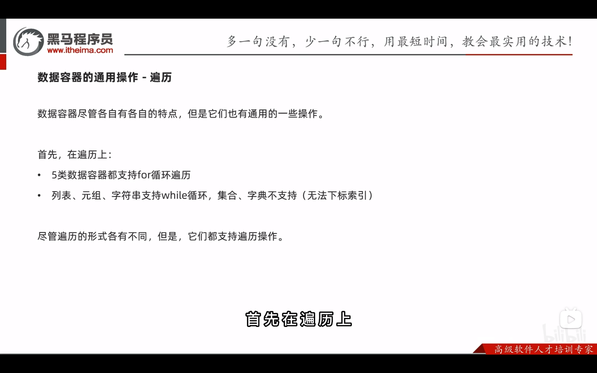
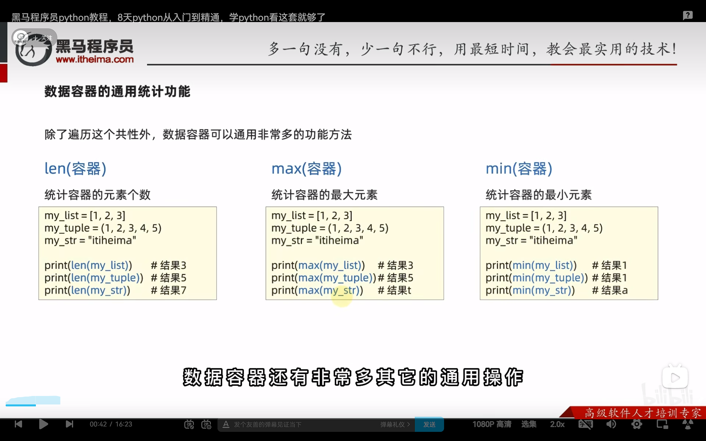
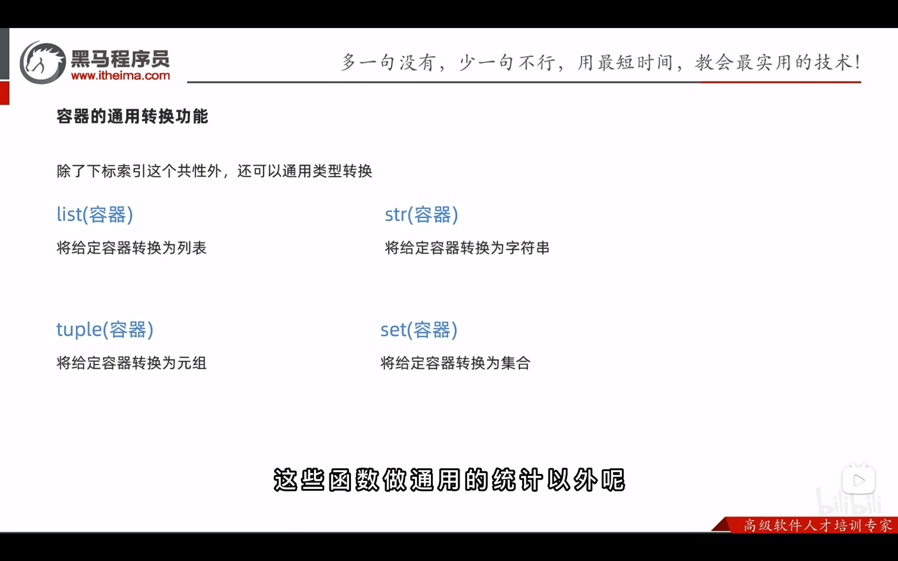
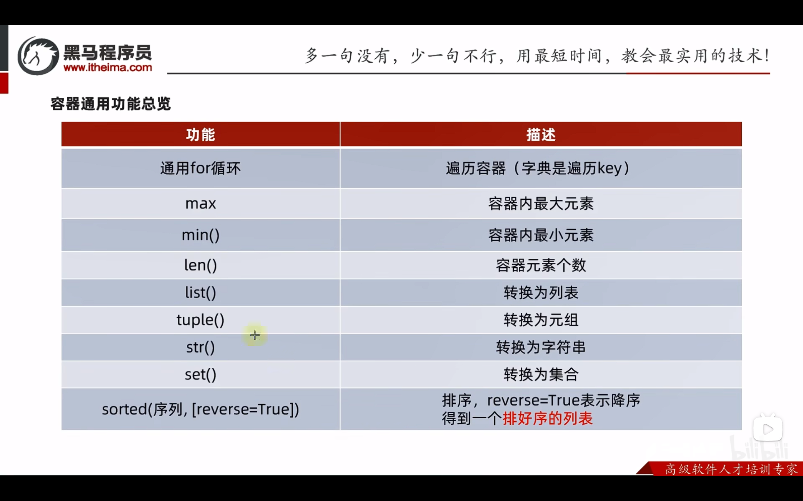

#### 通用操作


##### 1. 遍历




##### 2. 统计




##### 3. 转换




##### 4. 排功能

- sorted ( 容器 , [reverse = True] )	将给定的容器进行排序
- 排序结果全部转换成	**列表数据类型**

```python
my_list = [1, 2, 3, 4, 5]
my_tuple = (3, 2, 4, 1, 4)
my_str = "eadsa"
my_set = {1, 2, 6, 4, 5}
my_dict = {"key1": 1, "key3": 3, "key5": 2, "key4": 5, }

print(f"列表的排序：{sorted(my_list)}")
print(f"元组的排序：{sorted(my_tuple)}")
print(f"字符串的排序：{sorted(my_str)}")
print(f"集合的排序：{sorted(my_set)}")
print(f"字典的排序：{sorted(my_dict)}")

"""
输出：
列表的排序：[1, 2, 3, 4, 5]
元组的排序：[1, 2, 3, 4, 4]
字符串的排序：['a', 'a', 'd', 'e', 's']
集合的排序：[1, 2, 4, 5, 6]
字典的排序：['key1', 'key3', 'key4', 'key5']
"""
```

- 加上 reverse = True 可以进行反向排序

```python
my_list = [1, 2, 3, 4, 5]
my_tuple = (3, 2, 4, 1, 4)
my_str = "eadsa"
my_set = {1, 2, 6, 4, 5}
my_dict = {"key1": 1, "key3": 3, "key5": 2, "key4": 5, }

print(f"列表的反向排序：{sorted(my_list, reverse=True)}")
print(f"元组的反向排序：{sorted(my_tuple, reverse=True)}")
print(f"字符串反向的排序：{sorted(my_str, reverse=True)}")
print(f"集合的反向排序：{sorted(my_set, reverse=True)}")
print(f"字典的反向排序：{sorted(my_dict, reverse=True)}")

"""
输出：
列表的反向排序：[5, 4, 3, 2, 1]
元组的反向排序：[4, 4, 3, 2, 1]
字符串反向的排序：['s', 'e', 'd', 'a', 'a']
集合的反向排序：[6, 5, 4, 2, 1]
字典的反向排序：['key5', 'key4', 'key3', 'key1']
"""
```


##### 5. 通用操作


