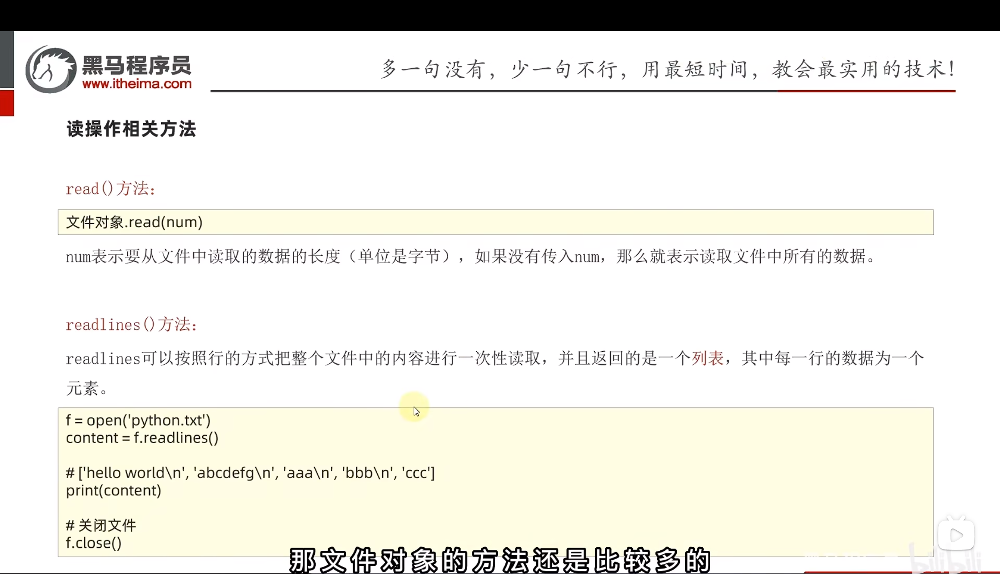
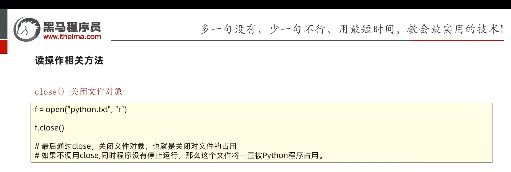
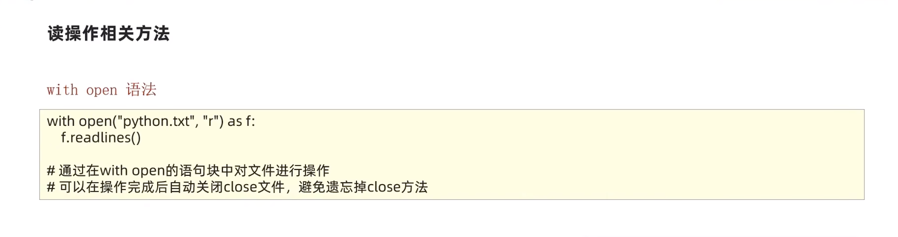
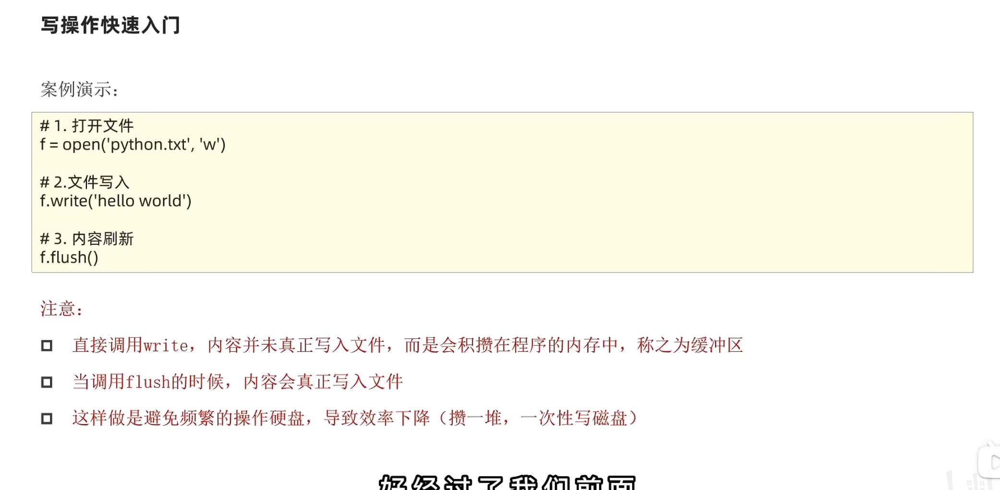
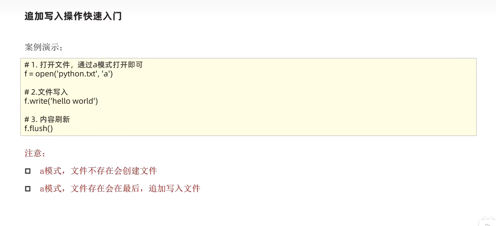

#### 1. 文件编码

&emsp; 编码技术：翻译规则，记录了如何将内容翻译成二进制，以及如何将二进制翻译回可识别内容。

常用编码：

- UTF-8
- GBK
- Big5

**. . . . . . **


#### 2. 文件的读取


##### 2.1 open() 打开函数

​	**语法：**

```python
open(name,mode,encoding)
```

- name：是要打开的目标文件名的字符串(可以包含文件所在的具体路径)
- mode：设置打开文件的模式（访问模式）：只读 (r)、写入 (w)、追加 (a)等
- encoding：编码格式(推荐使用 UTF-8)


​	**示例代码：**

```python
# 打开文件
f = open('python.txt','r',encoding = "UTF-8")
```


#### 3. 文件读取操作相关方法


##### 3.1. red() 方法、readlines() 方法





##### 3.2. readline () 方法


.png)


##### 3.3. for 循环读取文件

```python
f = open('python.txt', 'r', encoding="UTF-8")

# 使用for循环读取每一行数据
for line in f:
    print(line)
```


##### 3.4. 关闭文件

```python
# 打开文件
f = open('python.txt', 'r', encoding="UTF-8")

# 关闭文件
f.close()
```




##### 3.5. with open 语法

- 可以在文件操作完成后，自动关闭文件



```python
with open('python.txt', 'r', encoding="UTF-8") as f:
    for line in f:
        print(line)
```


#### 4. 文件的写入


```python
# 1.打开文件
f = open('python.txt','w')

# 2.文件写入
f.write('Hello world')

# 3.内容刷新
f.flush()

# 4.关闭文件
f.close() # 当调用close()函时，会自动刷新内容(不需要在调用flush()函数)
```




#### 5. 文件的追加




