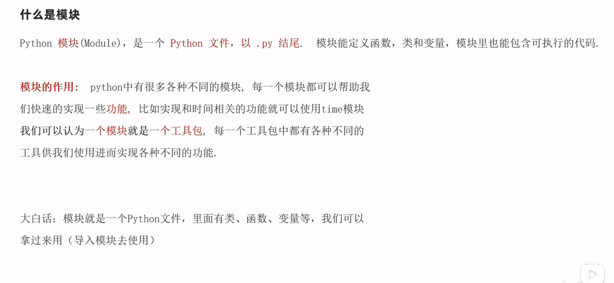
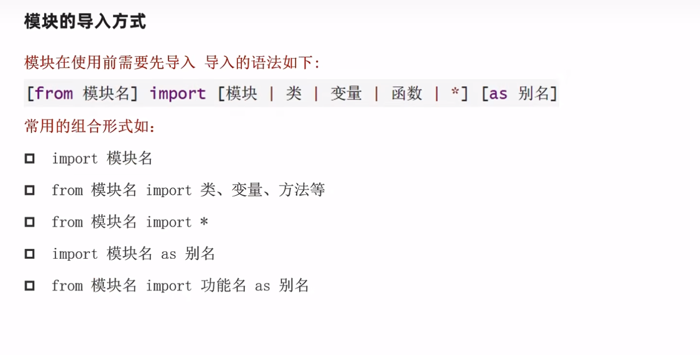
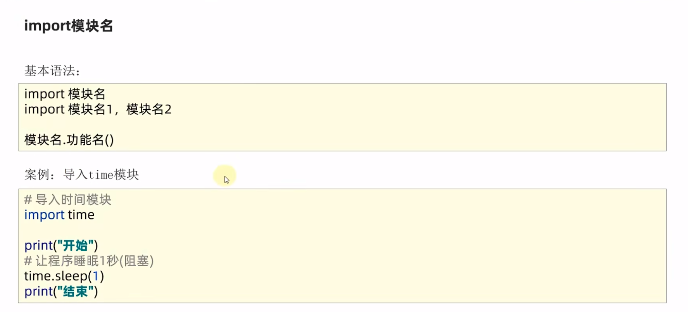
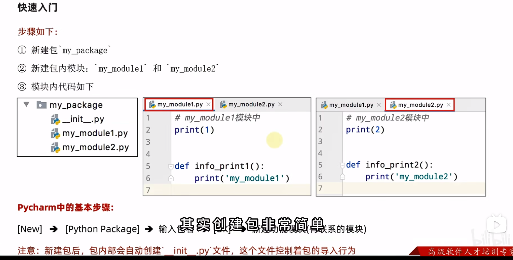
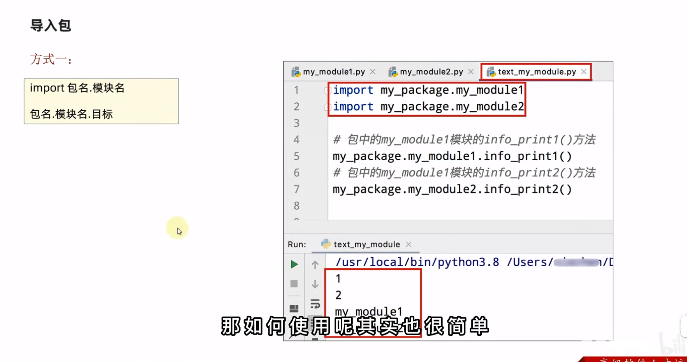
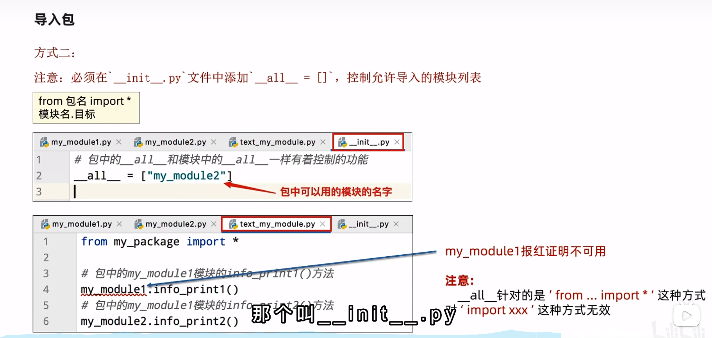
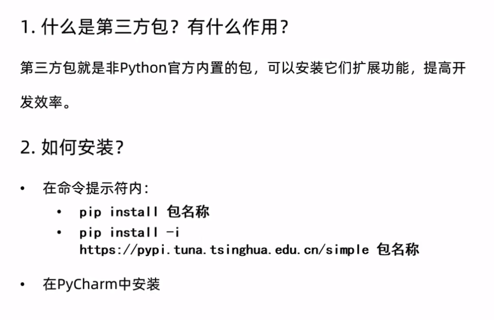

#### 1. 异常

&emsp; 当检测到一个错误时，Python解释器无法继续执行了。反而出现了一些错误，这就是所谓的 "异常"，也就是常说的 "BUG"。


##### 1.1 异常的捕获

- 对BUG进行提醒，整个程序继续运行。
- 捕获异常的作用：提前假设某处会出现异常，做好提前的准备，当真的出现异常的时候，可以有后续的手段。

###### 1.1.1 基本语法：

```python
try:
	可能发生的错误的代码
except:
	如果出现异常执行的代码
```

**示例代码：**

```python
try:
    f = open("abc.txt", 'r', encoding="UTF-8")
except:
    print("出现异常")
    f = open("python.txt", 'r', encoding="UTF-8")
```


##### 1.2 捕获指定的异常

###### 1.2.1 基本语法：

```python
try:
	print(name)
except NameError as e:
	print('name变量名称未定义')
```

**示例代码：**

```python
try:
    print(name)
except NameError as e:
    print("name未定义")
```


##### 1.3 捕获多个异常

```python
try:
    print(1 / 0)
except(NameError, ZeroDivisionError):
    print("NameError,ZeroDivisionError 错误")
```


##### 1.4 捕获全部异常

```python
# 方式1
try:
    print(1 / 0)
except Exception as e:
    print("错误")
    
# 方式2
try:
    print(1 / 0)
except:
    print("错误")
```


##### 1.5 异常 else

​	**语法：**

```python
try:
	可能发生的错误的代码
except:
	如果出现异常执行的代码
else:
	没有异常时执行的代码
```

​	**示例：**

```python
try:
    print(1 / 1)
except Exception as e:
    print("错误")
else:
    print("无错误")
```


##### 1.6 异常的 finally

​	**语法：**

```python
try:
	可能发生的错误的代码
except:
	如果出现异常执行的代码
else:
	没有异常时执行的代码
finally:
	无论是否异常都要执行的代码
```

​	**示例代码：**

```python
try:
    f = open("abc.txt", 'r', encoding="UTF-8")
except Exception as e:
    f = open("abc.txt", 'w', encoding="UTF-8")
else:
    print("无错误")
finally:
    f.close()
```


****


#### 2. Python 模块

&emsp; Python 模块(Module)：是一个 python 文件，以 .py 结尾。模块能定义函数，类和变量，模块里也能包含可执行的代码。




##### 2.1 模块导入




	

**示例：**

```python
# 导入模块
import time

time.sleep(5)

# 使用 from 导入
from time import sleep

sleep(5)

# 使用 * 导入模块的全部功能
from time import *	# * 表示全部的意思

sleep(4)
```


****


#### 3. Python 包

- 包本质上就是一个文件夹，在该文件夹下包含一个 **`__init__.py 文件`** ，该文件夹中包含 **多个模块文件**
- 作用：当我们的模块文件越来越多时，包可以帮助我们管理这些模块


##### 3.1 自定义包




##### 3.2 导入包

​	**方式1：**




​	**方式2：**




##### 3.3 第三方包


