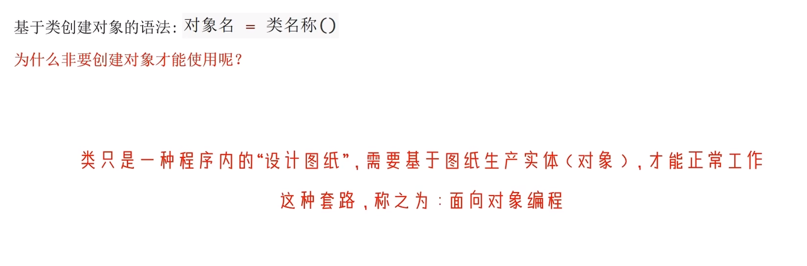

#### 面向对象编程

&emsp; 设计类，使用类创建对象，再调用所创建的对象中的方法和属性进行编程。




**示例代码：**

```python
# 设计一个闹钟类
class Clock:
    id = None
    price = None

    def ring(self):
        import winsound
        winsound.Beep(2000, 3000)


# 创建2个闹钟对象
clock1 = Clock()
clock1.id = "1234"
clock1.price = 19.99
print(f"闹钟id：{clock1.id},价格：{clock1.price}")
clock1.ring()

clock2 = Clock()
clock2.id = "2312"
clock2.price = 29.99
print(f"闹钟id：{clock2.id},价格：{clock2.price}")
clock2.ring()
```

