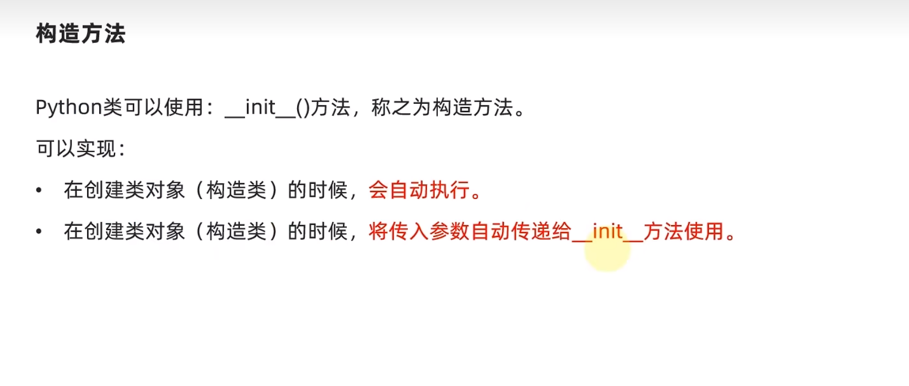

#### 构造方法

&emsp; Python 类可以使用：**`__init__()`** 方法，称之为构造方法。

可以实现：

- 在创建类对象（构造类）的时候，**会自动执行**。
- 在创建类对象（构造类）的时候，**将传入参数自动传递给 `__init__()` 方法 使用**。



**示例代码：**

- 方式1：

```python
# 设计类
class Student:
    name = None
    age = None
    tel = None

    def __init__(self, name, age, tel):
        self.name = name
        self.age = age
        self.tel = tel
        print("Student类创建了一个类对象")

# 创建对象
stu = Student("张三", 21, 1234)
print(stu.name, stu.age, stu.tel)
```

- 方式2：

```python
# 设计类
# 成员变量可以省略
class Student:

    def __init__(self, name, age, tel):
        self.name = name
        self.age = age
        self.tel = tel
        print("Student类创建了一个类对象")


stu = Student("张三", 21, 1234)
print(stu.name, stu.age, stu.tel)

```


****


#### 案例：

```python
class Student:

    def __init__(self, names, ages, address):
        self.name = names
        self.age = ages
        self.locate = address


stu = list()

for x in range(1, 11):
    print(f"当前录入第{x}学生信息，总共需录入10位学生信息。")
    name = input("输入姓名：")
    age = input("输入年龄：")
    locate = input("输入地址：")
    students = Student(name, age, locate)
    stu.append(students)
    print(f"学生{x}信息录入成功，信息为：姓名：{students.name},年龄：{students.age},地址：{students.locate}")
    print(stu[x - 1].name, stu[x - 1].age, stu[x - 1].locate)
```

