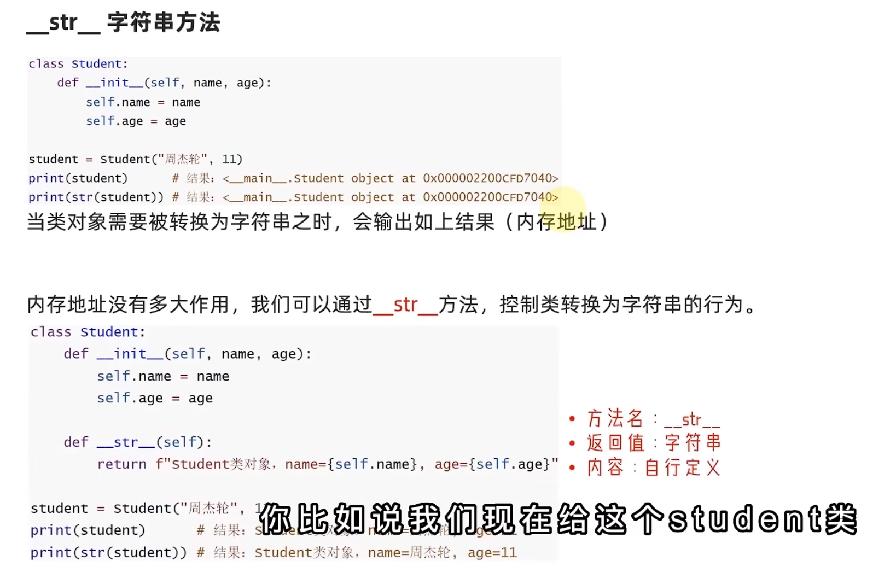
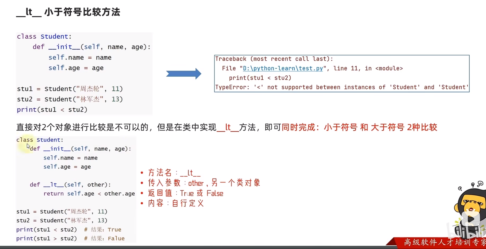
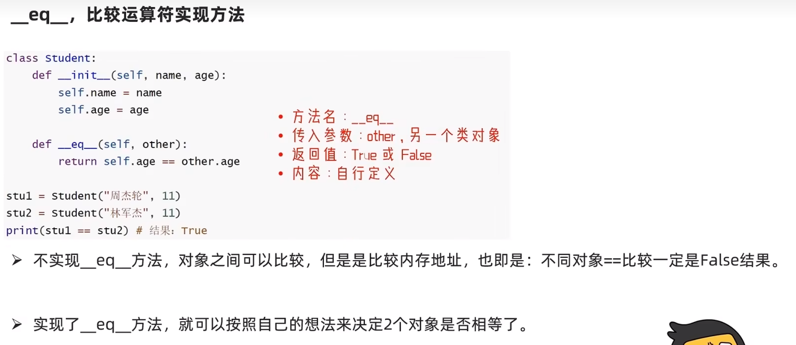

#### 魔术方法

&emsp; 上文学习的 **`__init__`** 构造方法，是Python类内置的方法之一。这些内置的类方法，各自有各自特殊的功能，这些内置方法我们称之为：**魔术方法** 。

| 编号 | 方法 | 作用 |
| :--: | :--: | ---- |
|  1   |   `__init__`   | 构造方法 |
|  2   | `__str__` | 字符串方法 |
|  3   | `__lt__` | 小于、大于符号比较 |
|  4   | `__le__` | 小于等于、大于等于符号比较 |
|  5   | `__eq__` | == 符号比较 |


****


##### 1. 字符串方法

- 当类对象需要被转换成为字符串之时，会输出 内存地址
- 可以通过 `__str__` 方法，控制类转换为字符串的行为




**代码示例：**

```python
class Student:
    def __init__(self, name, age):
        self.name = name
        self.age = age

    # __str__字符串方法
    def __str__(self):
        return f"name:{self.name},age:{self.age}"


stu = Student("张三", 21)
print(stu)

print(str(stu))

"""
输出：
name:张三,age:21
name:张三,age:21
"""
```


****


##### 2. 小于符号比较方法




**示例代码：**

```python
class Student:
    def __init__(self, name, age):
        self.name = name
        self.age = age

    def __lt__(self, other):  # other 表示另外一个对象
        return self.age < other.age


stu_1 = Student("张三", 21)
stu_2 = Student("李四", 20)
print(stu_1 < stu_2)
print(stu_1 > stu_2)

# 输出：
False
True
```


****


##### 3. 小于等于符号比较

```python
class Student:
    def __init__(self, name, age):
        self.name = name
        self.age = age

    def __lt__(self, other):  # other 表示另外一个对象
        return self.age < other.age

    def __le__(self, other):
        return self.age <= other.age


stu_1 = Student("张三", 21)
stu_2 = Student("李四", 20)
print(stu_1 <= stu_2)
print(stu_1 >= stu_2)

"""
输出：
False
True
"""
```


****


##### 4. 比较运算符





```python
class Student:
    def __init__(self, name, age):
        self.name = name
        self.age = age

    def __lt__(self, other):  # other 表示另外一个对象
        return self.age < other.age

    def __le__(self, other):
        return self.age <= other.age

    def __eq__(self, other):
        return self.age == other.age


stu_1 = Student("张三", 20)
stu_2 = Student("李四", 20)
print(stu_1 == stu_2)

"""
输出：True
"""
```

