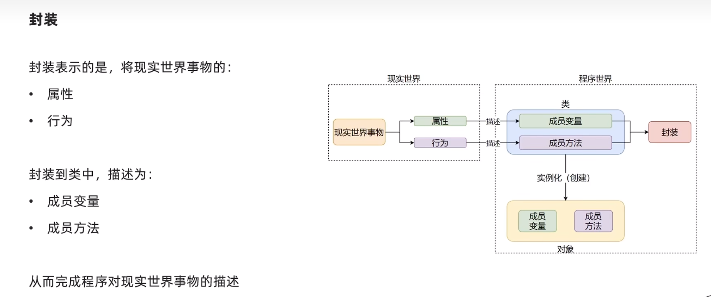

#### 面向对象的3大特性

- 1.封装
- 2.继承
- 3.多态


#### 1. 封装

&emsp;  将现实世界事物的**`属性`**和**`行为`**封装到类中，描述为**`成员变量`**和**`成员方法`**。从而完成程序对现实世界事物的描述。




##### 1. 私有成员变量和方法

①现实世界中的事物，有属性和行为。但是不代表这些属性和行为都是开放给用户使用的。

- 对用户**开放**的属性和行为
- 对用户**隐藏**的属性和行为

②类中提供了私有成员的形式来支持：

- 私有成员变量
- 私有成员方法

③私有成员的实际意义：

- 在类中提供了**仅供内部使用的属性和方法**，而不对外开放（类对象无法使用）


##### 1.1 定义私有成员的方式：

- 私有成员变量：变量名以**`__`**开头（2个下划线）
- 私有成员方法：方法名以**`__`**开头（2个下划线）

```python
class phone:
    IMEI: None  # 序列号
    producer: None  # 厂商

    __current_voltage = None  # 当前电压

    def call_by_5g(self):
        print("5g通话已经开启")

    # 私有成员方法
    def __keep_single_core(self):
        print("节省电源")
```

- 私有成员无法被类对象使用，但是**可以被其它的成员使用**。

```python
class Phone:
    IMEI: None  # 序列号
    producer: None  # 厂商

    __current_voltage = 0.5  # 当前电压

    def __keep_single_core(self):
        print("节省电源")

    # 私有成员方法
    def call_by_5g(self):
        if self.__current_voltage >= 1:
            print("5g通话已经开启")
        else:
            self.__keep_single_core()
            print("电量不足，无法使用5g通话，已经开启节省电源。")


phone = Phone()
phone.call_by_5g()

"""
输出：
节省电源
电量不足，无法使用5g通话，已经开启节省电源。
"""
```


##### 1.2 案例：设计带有私有成员的手机

```python
# 设计一个类，用来描述手机
class Phone:
    # 提供私有成员：__is_5g_enable
    __is_5g_enable = False  # 5g状态

    # 提供私有成员方法：__check_5g()
    def __check_5g(self):
        if self.__is_5g_enable == True:
            print("5g开启")
        else:
            print("5g关闭，使用4g网络")

    # 提供公开的成员方法：call_by_5g()
    def call_by_5g(self):
        self.__check_5g()
        print("正在通话中")


phone = Phone()
phone.call_by_5g()
```


****


#### 2. 继承

&emsp; 将已有的类，拿过来，再添加新的功能。从而形成一个新的类。（一个类继承另外一个已有的类的成员变量和成员方法）。


##### 1. 继承语法


###### ①单继承：

```python
class 类名(父类名):
	类内容体
```


**示例代码：**

```python
# 单继承
class Phone:
    IMEI = None
    producer = "华为"

    def call_by_4g(self):
        print("4g通话")


class Phone2022(Phone):
    face_id = "10001"

    def call_by_5g(self):
        print("2022年新功能：5g通话")


phone = Phone2022()
print(phone.producer)
phone.call_by_4g()
phone.call_by_5g()
```


###### ② 多继承：

```python
class 类名(父类1,父类2,......,父类N)：
	类内容体
```

- **pass** 关键字

```
  用于补全语法，代表为空。
```

  


**示例代码：**

```python
# 多继承
class Phone:
    IMEI = None
    producer = "华为"

    def call_by_4g(self):
        print("4g通话")


class NFCreader:
    type = "5代"
    producer = "HW"

    def read_card(self):
        print("NFC读卡")

    def write_card(self):
        print("NFC写卡")


class RemoteControl:
    rc_type = "红外遥控"

    def control(self):
        print("红外遥控开启")


class My_Phone(Phone, NFCreader, RemoteControl):
    pass  # 补全语法，代表为空


phone = My_Phone()
phone.call_by_4g()
phone.read_card()
phone.write_card()
phone.control()

"""
输出：
4g通话
NFC读卡
NFC写卡
红外遥控开启

"""
```


##### 2. 注意事项

&emsp; 多个父类中，如果有同名的成员，那么 **默认** 以继承顺序（从左到右）为优先级。

- 即：**先继承的保留，后继承的被覆盖**

```python
class Phone:
    IMEI = None
    producer = "华为"

    def call_by_4g(self):
        print("4g通话")


class NFCreader:
    type = "5代"
    producer = "HW"

    def read_card(self):
        print("NFC读卡")

    def write_card(self):
        print("NFC写卡")


class RemoteControl:
    rc_type = "红外遥控"

    def control(self):
        print("红外遥控开启")


class My_Phone(Phone, NFCreader, RemoteControl):
    pass  # 补全语法，代表为空


phone = My_Phone()

# 在 Phone 和 NFCreader类中 producer 成员变量同名
print(phone.producer)

# 输出：华为
```


****


##### 3. 复写

&emsp; 在子类中重新定义同名的属性和方法。


**示例代码：**

```python
class Phone:
    IMEI = None
    producer = "华为"

    def call_by_5g(self):
        print("使用5g网络通话")


class My_Pone(Phone):
    producer = "HW"

    def call_by_5g(self):
        print("开启省电模式")
        print("使用5g网络通话")


phone = My_Pone()
phone.call_by_5g()
print(phone.producer)
```


##### 4. 调用父类同名成员


