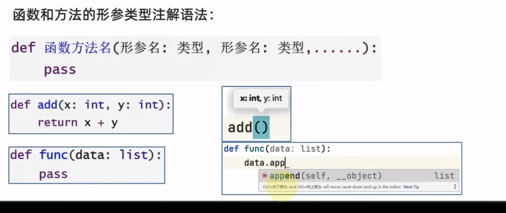
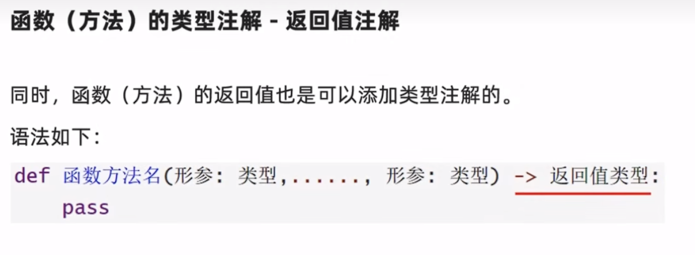
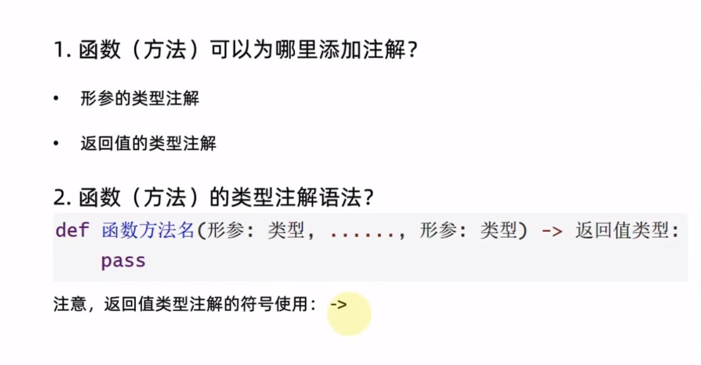
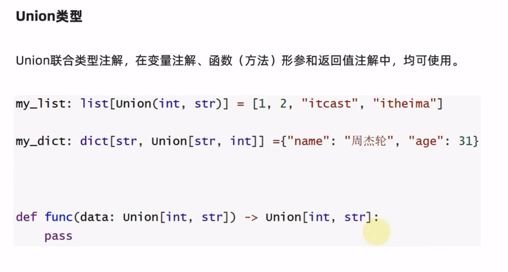

#### 类型注解

   


#### 1. 基础语法：

****

##### 方式1：

```
变量 : 类型
```

- 基础数据类型注解

  ```
  var_1: int = 10
  var_2: float = 3.1415926
  var_3: bool = True
  var_4: str = "chen"
  ```

- 类对象类型注解

  ```python
  class student:
  	pass
  stu: student = student()
  ```

- 基础容器类型注解

  ```python
  My_list: list = [1,2,3]
  My_tuple: tuple = (1,2,3)
  My_set: set = {1,2,3}
  ......
  ```

- 容器类型详细注解

  ```python
  My_list: list[int] = [1,2,3]
  My_tuple: tuple[str,int,bool] = ("chen",2,True)
  My_set: set[int] = {1,2,3}
  ......
  ```

  

##### 注意事项

- 元组类型设置类型详细注解，需要将每一个元素都标记出来
- 字典类型设置类型详细注解，需要2个类型，第一个是Key，第二个是value


##### 方式2：


#### 2. 类型注解的限制

****

类型注解主要功能在于：

- 帮助第三方IDE工具（如：PyCharm）对代码进行类型推断，协助代码提示
- 帮助开发者自身对变量进行类型注解（备注）

并不会真正的对类型做验证和判断。类型注解 **仅仅是提示性的，不是决定性的**。

  


#### 3. 函数（方法）形参进行类型注解

****


##### 3.1. 对函数形式参数的注解




##### 3.2. 对函数返回值注解



**示例：**

```python
# 函数形式参数注解
def add(x: int, y: int):
    pass


# 函数返回值注解
def func(data: list) -> list:
    return data


add()
```


##### 3.3. 函数注解总结




#### 4. Union 类型联合注解

****




**示例：**

```python
# 使用Union 联合类型注解
from typing import Union  # 导包

# 基础注解
my_list: list[Union[str, int]] = [1, 2, "chen"]
my_dict: dict[str, Union[str, int]] = {"name": "chen", "age": 21}


# 函数注解
def func(data: Union[int, str]) -> Union[int, str]:
    pass


func()
```

