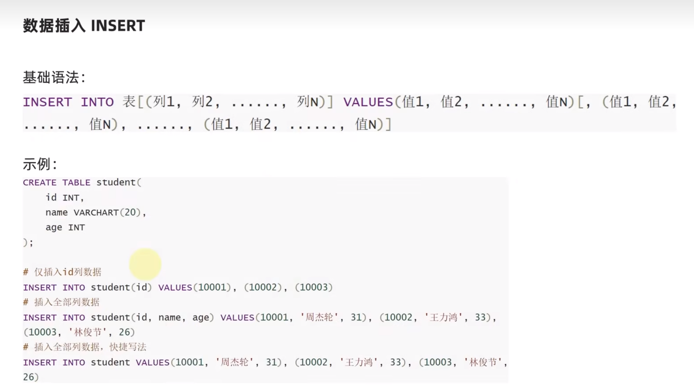

#### 数据库

**库——>表——>数据**


#### MySQL 入门使用


#### MySQL 图形化软件安装


****


#### SQL 语言

- 结构化查询语言
- 用于 <span style="color:orange"> 访问和处理数据库的标准的计算机语言 </span>


#### SQL 语言分类


#### SQL 语言的语法特征

- SQL 语言，大小写不敏感
- SQL 可以单行或多行书写，最后以 **`;`** 结束
- SQL 支持注释：
  - 单行注释：-- 注释内容   (-- 后面要有一个空格)
  - 单行注释：# 注释内容 （# 后面可以不加空格，推荐加上）
  - 多行注释：/* 注释内容 */

****


#### DDL - 库管理


****


#### DDL - 表管理


****


#### DML

&emsp; 是指数据操作语言，用于对数据库中表的数据记录进行更新。

**关键字：**

- 插入 INSERT
- 删除 DELETE
- 更新 UPDATE


##### 1. 数据插入



**代码示例：**

```sql
# 在id 这列数据插入3个值
insert into student(id) values(1),(2),(3);
# 插入全部列的数据
insert into student(id,name,age) values(4,'张三',21),(5,'李四',34);
# 省略写法
insert into student values(6,'王二',23);
```

****


##### 2. 数据删除


**代码示例：**

```sql
# 删除id为1的数据
delete from student where id = 1;
# 删除id小于等于3的数据
delete from student where id <= 3;
```

****


##### 3. 数据更新


**代码示例：**

```sql
# 将id为1的name值修改为'chen'
update student set name = 'chen' where id = 1; 
```

****


#### DQL - 数据查询


##### 1. 基础查询


****


##### 1.2. 基础查询 - 过滤


**代码示例：**

```sql
# 基础数据查询
select iname,age from student;
# 查询全部数据
select * from student;

# 基础查询-过滤
select * from student where age > 20;
```

****

#### 

##### 2. 分组聚合查询

 


**示例代码：**

```sql
# 按照性别分组，求平均年龄
select sex,avg(age) from student group by sex

select sex,avg(age),sum(age),max(age),min(age),count(sex)  from student group by sex
select sex,avg(age),sum(age),max(age),min(age),count(*)  from student group by sex
```

****


##### 3. 排序分页查询


- ASC 从小到大
- DESC 从大到小

**代码示例：**

```sql
# 结果排序
# 升序排序
select * from student where age > 20 order by age asc;
# 降序排序
select * from student where age > 20 order by age desc ;
```

****


##### 3.1 结果分页限制


**代码示例：**

```sql
# 结果分页限制
# 结果查询限制3条
select * from student limit 3;
# 结果查询从第2条开始，查询4条数据
select * from student limit 2,4;
```

****


```sql
/*
show databases;# 查看数据库

create database test charset utf8;# 添加数据库

drop database test;# 删除数据库
*/

use test
show tables;
select database();

create table student(
	id int,
	name varchar(10),
	age int
);

# 添加列
alter table student add sex varchar(5);

drop table student;

# 在id 这列数据插入3个值
insert into student(id) values(1),(2),(3);

# 插入全部列的数据
insert into student(id,name,age) values(4,'张三',21),(5,'李四',34);
# 省略写法
insert into student values(6,'王二',23);

# 删除
delete from student where id = 1;
delete from student where id <= 3;

# 更新
update student set name = 'chen' where id = 1; 

update student set sex = '男' where id = 1;
update student set sex = '女' where id = 2;
update student set sex = '男' where id = 3;
update student set sex = '女' where id = 4;
update student set sex = '男' where id = 5;
update student set sex = '女' where id = 6;

# 基础数据查询
select iname,age from student;
# 查询全部数据
select * from student;

# 基础查询-过滤
select * from student where age > 20;

# 分组聚合查询
select sex,avg(age) from student group by sex

select sex,avg(age),sum(age),max(age),min(age),count(sex)  from student group by sex
select sex,avg(age),sum(age),max(age),min(age),count(*)  from student group by sex

# 结果排序
select * from student where age > 20 order by age asc;
select * from student where age > 20 order by age desc ;

# 结果分页限制
select * from student limit 3;
select * from student limit 2,4;


```

