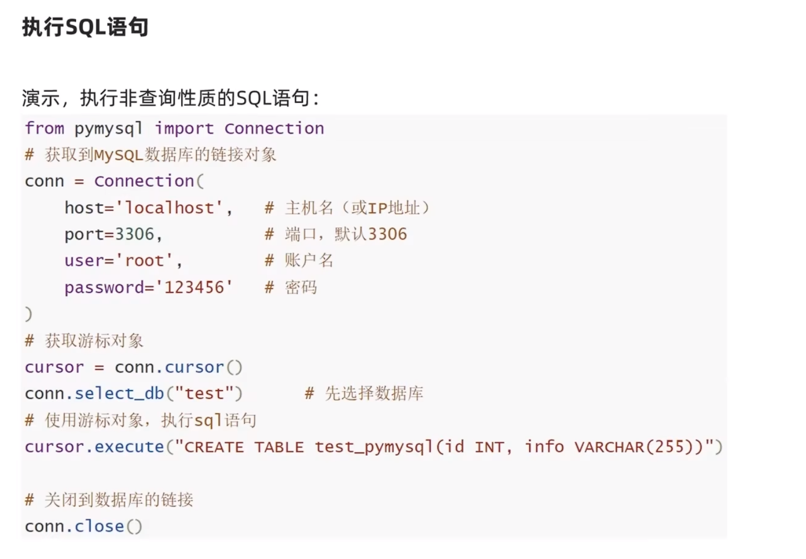

### python 操作MySQL


#### 1. 基础使用


##### 1.1 执行SQL语句


- 执行非查询性质的SQL语句

****




- 执行查询性质的SQL语句

****


****


#### 2. 数据插入


##### 2.1提交

 

**示例代码：**

```python
from pymysql import Connection

conn = Connection(
    host="localhost",
    port=3306,
    user="root",
    password="2815834616",
    autocommit=True  # 自动提交
)
cursor = conn.cursor()
conn.select_db("test")  # 选择数据库test
# 插入数据
cursor.execute("insert into student values (8,'王六',31,'女')")

# # 通过commit()提交
# conn.commit()

# 关闭数据库链接
conn.close()

```

