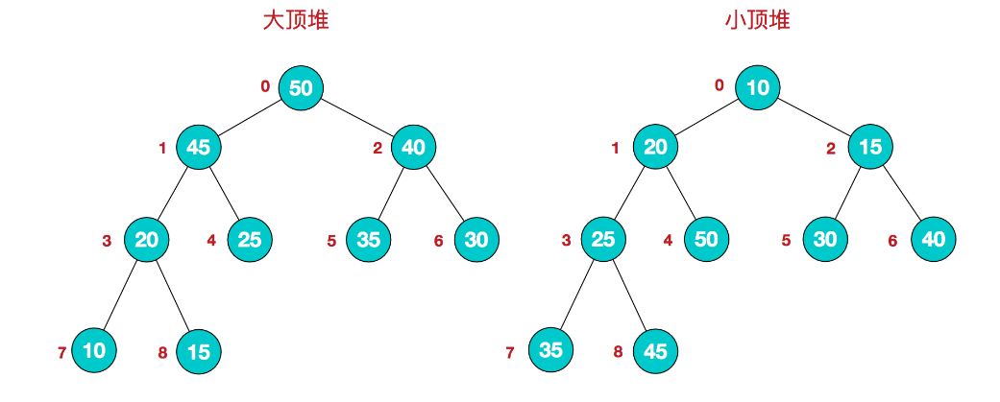
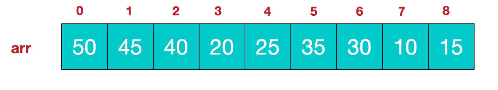

# 堆排序(Heap Sort)

&emsp;&emsp;堆排序是利用**堆**这种数据结构而设计的一种排序算法，堆排序是一种**选择排序**，它的最坏，最好，平均时间复杂度均为$O(nlogn)$，但堆排序是不稳定排序。

## 原理

&emsp;&emsp;依据堆的性质，可以将堆分为**大顶堆**和**小顶堆**:

- 大顶堆： 父节点的值都**大于**或等于其左右子节点的值；
- 小顶堆： 父节点的值都**小于**或等于其左右子节点的值；



&emsp;&emsp;首先，堆可以被看成一个近似的完全二叉树，因此它可以使用数组来实现。对于完全二叉树的静态存储，给定某个结点的编号$i$,我们可以很容易得到其左右子节点的编号：

- $left(i) = 2*i + 1$;
- $right(i) = 2*i + 2$

如下：


&emsp;&emsp;因此，大顶堆和小顶堆用公式描述如下：

- 大顶堆: $arr[i] >= arr[2i + 1] \&\& arr[i] >= arr[2i + 2]$
- 小顶堆: $arr[i] <= arr[2i + 1] \&\& arr[i] <= arr[2i + 2]$

&emsp;&emsp;堆排序(以升序为例)过程如下：

- 用数列构建出一个大顶堆，取出堆顶的数字并将该元素与末尾元素交换；
- 调整剩余的数字，构建出新的大顶堆，再次取出堆顶元素；
- 重复上述步骤，直至堆的大小为零。

&emsp;&emsp;花几十秒观看下堆排序的整个流程


&emsp;&emsp;因此，堆排序中我们需要解决两个主要问题：

- 如何构建大顶堆？
- 取出堆顶元素后，如何将剩余数字调整成新的大顶堆？

## 实现

&emsp;&emsp;从动画演示中可以看到，构建堆的过程本身就是一个调整的过程。因此，只需要单独实现一个调整函数$heapify(arr,i,N)$。它表示对节点$i$,进行调整。调整过程无非就是：将节点$i$的值与节点$i、2i+1、2i+2$中的最大值进行交换。

```C++
void heapify(int arr[], int N, int i)
{
    // 三个节点的最大值初始化为父节点i
    int largest = i;
    // 左孩子
    int l = 2 * i + 1;
    // 右孩子
    int r = 2 * i + 2;

    // 判断左孩子的值是否比父节点的值大，若大，更新
    if (l < N && arr[l] > arr[largest])
        largest = l;
    // 判断右孩子的值是否比父节点的值大，若大，更新
    if (r < N && arr[r] > arr[largest])
        largest = r;
    
    // 若最大值不是结点i,则需要将最大结点作为父节点从而构建大顶堆
    if (largest != i) {
        swap(arr[i], arr[largest]);
        // 再次调整交换后的大顶堆
        heapify(arr, N, largest);
    }
}
```

&emsp;&emsp;有了上述代码后，我们可以轻松写出构建大顶堆的代码，构建过程是自底向上的：

```C++
for (int i = N / 2 - 1; i >= 0; i--)
        heapify(arr, N, i);
```

> 对于完全二叉树的数组存储$arr$,其最后一个叶子结点的下标为$(len/2)-1$。

&emsp;&emsp;之后排序过程中，我们一边取走堆顶元素与数组最后一个元素进行交换，一边调整堆:

```C++
    for (int i = N - 1; i > 0; i--) {
  
        // 将堆顶元素与最后一个元素进行交换
        swap(arr[0], arr[i]);
  
        // 调整剩余数组，使其满足大顶堆
        heapify(arr, i, 0);
    }
```

**完整代码:**

```C++
// 堆调整
void heapify(int arr[],int len,int i){
    int largest = i;
    int l = 2*i + 1;
    int r = 2*i + 2;

    if(l < len && arr[l] > arr[largest]){
        largest = l;
    }
    if(r < len && arr[r] > arr[largest]){
        largest = r;
    }
    if(largest != i){
        swap(arr[i],arr[largest]);
        heapify(arr,len,largest);
    }
}
void heapSort(int arr[],int len){
    // 构建大顶堆
    for(int i = len/2 - 1;i >= 0;i--){
        heapify(arr,len,i);
    }
    // 取出堆顶元素并与待排序序列的最后一个位置交换
    for(int i = len-1;i>0;i--){
        swap(arr[i],arr[0]);
        heapify(arr,i,0);
    }
}
```

## 习题

### 习题一

&emsp;&emsp;给定整数数组 $nums$ 和整数 $k$，请返回数组中第 $k$ 个最大的元素。请注意，你需要找的是数组排序后的第 $k$ 个最大的元素，而不是第 $k$ 个不同的元素。

> 思路

&emsp;&emsp;对于堆排序，每次调整后的堆顶元素就是所有元素的最大值，因此，本题其实就是求调整$k$次后的堆顶元素是多少。

> 代码

```C++
class Solution {
public:
    int findKthLargest(vector<int>& nums, int k) {
        // 构建大顶堆,调整了1次
        int len = nums.size();
        for(int i = len/2 -1;i >= 0;i--){
            heapify(nums,i,len);
        }
        // 调整k-1次
        for(int i = len-1;i > len-k;i--){
            swap(nums[0],nums[i]);
            heapify(nums, 0, i);
        }
        // 直接返回调整了k次后的堆顶元素
        return nums[0];
    }

    void heapify(vector<int>& nums,int i,int n){
        int largest = i;
        int l = 2*i+1;
        int r = 2*i+2;
        if(l < n && nums[l] > nums[largest]){
            largest = l;
        }
        if(r < n && nums[r] > nums[largest]){
            largest = r;
        }

        if(largest != i){
            swap(nums[i],nums[largest]);
            heapify(nums,largest,n);
        }
    }
};
```

### 习题二

&emsp;&emsp;输入整数数组 $arr$ ，找出其中最小的 $k$ 个数。例如，输入4、5、1、6、2、7、3、8这8个数字，则最小的4个数字是1、2、3、4。

> 思路

&emsp;&emsp;本题其实就是求调整$k$次小顶堆中，每次的最小值所构成的数组。

> 代码
  
```C++
class Solution {
public:
    vector<int> getLeastNumbers(vector<int>& arr, int k) {
        // 若k=0，则返回空序列
        if(0==k){
            return {};
        }
        // 构建小顶堆
        int N = arr.size();
        for(int i=N/2-1;i >= 0;i--){
            heapify(arr,N,i);
        }
        vector<int> ans;
        for(int i=N-1;i > N-k;i--){
            ans.push_back(arr[0]);
            swap(arr[0],arr[i]);
            heapify(arr,i,0);
        }
        // k-1次调整后，还需要将堆顶元素取出
        ans.push_back(arr[0]);
        return ans;
    }

    void heapify(vector<int>& arr,int n,int i){
        int minn = i;
        int l = 2 * i + 1;
        int r = 2 * i + 2;
        if(l < n && arr[l] < arr[minn]){
            minn = l;
        }
        if(r < n && arr[r] < arr[minn]){
            minn = r;
        }

        if(minn != i){
            swap(arr[i],arr[minn]);
            heapify(arr,n,minn);
        }
    }
};
```
