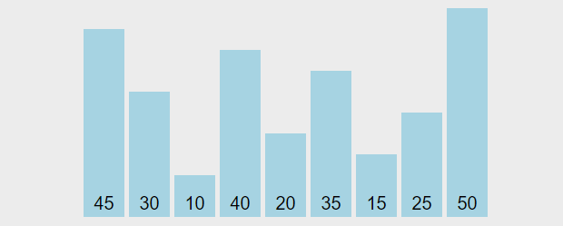
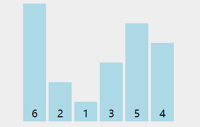

# 冒泡排序(Bubble Sort)

&emsp;&emsp;冒泡排序是最简单、最经典的排序算法。无论哪本教材，一旦谈到排序算法，都会先讨论冒泡排序。

## 原理

&emsp;&emsp;假定一个长为$n$的序列，那么未优化的冒泡排序至少会进行$n-1$轮，每轮中，对序列中的元素进行两两比较，依据排序规则(升序或降序)，将最大/最小值放在最后。每进行一轮，总能在待排序的序列中找到最小/最大值并将其放在待排序序列的最右边。因此，经过$n-1$轮后(因为最后一轮所剩下的元素一定是有序的)，整个序列就变成了有序序列。



> 上面动图中，蔚蓝色就是待排序序列，黄色是已排序序列，绿色是正在执行两两判断与交换的元素。

## 实现

### 代码一

```C++
void bubbleSortWay1(int arr[],int len){
    for(int i=0;i<len-1;i++){
        for(int j=0;j<len-1-i;j++){
            if(arr[j] > arr[j+1]){
                int t = arr[j];
                arr[j] = arr[j+1];
                arr[j+1] = t;
            }
        }
    }
}
```

&emsp;&emsp;最外层的 for 循环每经过一轮，剩余数字中的最大值就会被移动到当前轮次的最后一位，中途也会有一些相邻的数字经过交换变得有序。总共比较次数是$(n-1)+(n-2)+(n-3)+...+1$。

&emsp;&emsp;这种写法相当于相邻的数字两两比较，并且规定：“谁大谁站右边”。经过 $n−1$ 轮，数字就从小到大排序完成了。整个过程看起来就像一个个气泡不断上浮，这也是“冒泡排序法”名字的由来。

### 代码二

&emsp;&emsp;代码二是根据代码一优化而来的。

```C++
void bubbleSortWay2(int arr[],int len){
    // 当前这轮的待排序列是否发生了交换(是否是有序的)
    // true为没有交换(有序)
    bool flag;
    for(int i=0;i<len-1;i++){

        flag = true;
        for(int j=0;j<len-1-i;j++){
            if(arr[j] > arr[j+1]){
                int t = arr[j];
                arr[j] = arr[j+1];
                arr[j+1] = t;
                flag = false;
            }
        }
        // 如果已是有序，则后序几轮不必执行
        if(flag){
            break;
        }
    }
}
```

&emsp;&emsp;我们知道冒泡排序每一轮都需要对待排序数组进行两两比较并依据比较结构进行交换。可以假设在某一轮中，待排序列没有出现交换，其实就说明了整个序列已是有序状态了。此时，若不采取策略，算法后序还会对有序序列进行无用的比较。因此，我们可以引入一个变量来判断当前这轮是否执行了交换，若没有执行，则说明已是有序的了，跳出循环即可。



> 上图演示了代码二的执行过程，可以看到，在第三轮中没有发生交换，说明序列已是有序的了，不在执行后序几轮。

### 代码三

&emsp;&emsp;一般的冒泡排序代码使用的就是代码二，此处介绍的代码三并不常用，是基于代码二的再度优化。

```C++

void bubbleSortWay3(int arr[],int len){
    // 记录最后一次交换的位置，初始化是数组最后一个元素的位置
    int lastSwap = len-1;
    // 记录交换位置
    int lastIndex = -1;
    bool flag;
    for(int i=0;i<len-1;i++){
        flag = true;
        for(int j=0;j<lastSwap;j++){
            if(arr[j] > arr[j+1]){
                int t = arr[j];
                arr[j] = arr[j+1];
                arr[j+1] = t;
                flag = false;
                // 记录交换位置
                lastIndex = i;
            }
        }
        // 更新最后一次交换的位置
        // 下一轮排序就只需对该位置之前的元素进行排序即可
        lastSwap = lastIndex;
        if(flag){
            break;
        }

    }
}
```

&emsp;&emsp;在每一轮中，我们记录最后一次进行交换的位置即可，因为最后一次进行交换的位置的后面一定是有序的，我们只需要对该位置之前的序列进行排序。

&emsp;&emsp;根据代码，我们可以判断冒泡排序的时间复杂度和空间复杂度分别为：$O(n^2)$和$O(1)$。

## 习题

### 习题一

&emsp;&emsp;输入一个非负整数数组，把数组里所有数字拼接起来排成一个数，打印能拼接出的所有数字中最小的一个。

示例一

```
输入: [10,2]
输出: "102"
```

示例二

```
输入: [3,30,34,5,9]
输出: "3033459"
```

> 思路

- 题目要求使用数组中所有的数进行拼接，使得拼接后的数是所有排列中最小的。
- 我们采用贪心策略，从局部最优解得到全局最优解。我们利用冒泡排序，每次将数组中的两个比较元素$a$和$b$组成两种字符串"$ab$"和"$ba$"。若"$ab$" > "$ba$",则将$a$和$b$进行交换。由冒泡排序原理我们可以知道，每进行一轮比较，最右边的**已排序列**组成的字符串一定是最小的。当整个序列依据"$ab$"和"$ba$"的大小关系排序完成后，整个序列拼接起来的字符串一定是最小的。证明略。
- 本题本质上就是一道排序题，并且使用的排序方法只能是基于比较的排序方法。比较规则就是依据"$ab$"和"$ba$"两字符串的大小关系进行的。

> 代码

```C++
class Solution {
public:
    string minNumber(vector<int>& nums) {
        bool flag;
        int len = nums.size();
        for(int i=0;i<len-1;i++){
            for(int j=0;j<len-1-i;j++){
                // 字符串: "ab"
                string ab = to_string(nums[j]) + to_string(nums[j+1]);
                // 字符串: "ba"
                string ba = to_string(nums[j+1]) + to_string(nums[j]);
                if(ab > ba){
                    // 交换两数,调用Algorithm库已实现的函数
                    swap(nums[j],nums[j+1]);
                    flag = false;
                }
            }
            if(flag){
                break;
            }
        }
        string ans = "";
        for(int i=0;i<len;i++){
            ans += to_string(nums[i]);
        }
        return ans;
    }
};
```

### 习题二

&emsp;&emsp;给定一个数组 $nums$，编写一个函数将所有 $0$ 移动到数组的末尾，同时保持非零元素的相对顺序。请注意 ，必须**在不复制数组**的情况下原地对数组进行操作。

示例

```
输入: nums = [0,1,0,3,12]
输出: [1,3,12,0,0]
```

> 思路

- 本题让在一个给定的数组中，在保证其非零元素的相对顺序情况下，将数组中的所有零移动至数组尾部。
- 扯开下话题：其实数组中的零就可以想象成"泡泡"，这些"泡泡"冒出的方向就是数组最右边。
- 当前元素$a_j$为$0$时，我们将$a_j$与$a_{j+1}$进行交换。进行$n-1$轮后，元素为$0$的元素就都在数组最右边了。

> 代码

```C++
class Solution {
public:
    void moveZeroes(vector<int>& nums) {
        int len = nums.size();
        bool flag;
        for(int i=0;i<len-1;i++){
            flag = true;
            for(int j=0;j<len-i-1;j++){
                if(0 == nums[j]){
                    int t = nums[j+1];
                    nums[j+1] = nums[j];
                    nums[j] = t;
                    flag =false;
                }
            }
            if(flag){
                return;
            }
        }
    }
};
```

## 总结

冒泡排序优点：

- 冒泡排序易于理解与实现；
- 不需要额外的存储空间
- 适用于不同的数据类型
- 冒泡排序是一种稳定的排序算法，稳定就是在针对相同元素进行排序时，它可以保证其原有的相对顺序。

> 实际上，冒泡排序的稳定与否主要是看你具体代码实现的比较逻辑。大多数稳定的排序算法都可以因为具体的实现逻辑产生不稳定的排序结果。但一般情况下，稳定性只要可控，都可以归为稳定排序。

冒泡排序缺点：

- 冒泡排序的时间复杂度为$O(n^2)$,在针对大型数据的排序时，效率十分低；
