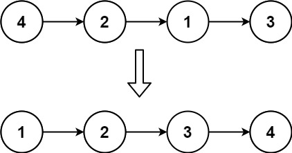

# 插入排序(Insertion Sort)

## 原理

&emsp;&emsp;插入排序是一种最简单直观的排序算法，它的工作原理是通过构建有序序列，对于未排序数据，在已排序序列中从后向前扫描，并找到相应位置插入。流程如下：

- 将待排序列的第一个元素看做是一个有序序列，把第二个元素到最后一个元素当做无序序列；
- 从头到尾依次扫描未排序序列，将扫描到的每一个元素插入有序序列的适当位置；
- （若待插入的元素与有序序列中的某个元素相等，则将待插入元素插入到相等元素的后面，保证排序的稳定性）。

> 插入排序的原理和打扑克牌类似，拿斗地主来说，个人的牌就喜欢从左往右放置，从第二张收到的牌开始，每收到一张牌就确认该牌应该在手中什么位置。直至牌发完后，手上的牌就处于一个有序状态。

插入排序有两种写法：

- 交换法：在新数字插入过程中，不断与前面的数字交换，直到找到合适的位置。
- 移动法：在新数字插入过程中，与前面的数不断比较，前面的数不断向后挪出位置，当新数找到自己的位置后，插入即可。

为了更好突出插入这一特性，一般选择移动法进行实现。下图演示的就是移动法实现的插入排序


## 实现

### 代码一：交换法

```C++

void insertionSort_swap(int arr[],int len){
    // 从第二个元素开始执行，因为第一个元素可以视为有序
    for(int i=1;i<len;i++){
        // j是起始位置
        int j = i;
        // 当前元素比左边的元素小，就交换，直到该元素到达该到的位置
        while(j >= 1 && arr[j] < arr[j-1]){
            int t = arr[j];
            arr[j] = arr[j-1];
            arr[j-1] = t;
            // 不断向左进行交换
            j--;
        }
    }
}
```

&emsp;&emsp;对于**长度小于2的待排序列，其本身就是有序的**，因此可以直接从第二个元素开始执行插入排序。整个过程其实就类似与一个个子矮的人想要在人群中看戏一样。他需要不断跟个子高(元素大)的人交换位置，直到前面的人比他矮，后面的人比他高（找到合适位置），才能看到戏（其实更想说看热闹，中国人的传统嘛）。

### 代码二：移动法

&emsp;&emsp;通过交换法，可以发现算法执行过程中，其实做了很多没必要的交换。我们只需要将大的数不断往后挪，直到空出来的位置适合当前元素后，插入即可。

```C++
void insertionSort_move(int arr[],int len){
    for(int i=1;i<len;i++){
        int j = i - 1;
        // t是当前元素
        int t = arr[i];
        while(t < arr[j] && j >= 0){
            // 往后挪
            arr[j+1] = arr[j];
            j--;
        }
        // 插入
        arr[j+1] = t;
    }
}
```

&emsp;&emsp;拿看戏举例，移动法就像有一个小地痞拿着个大喇叭不断喊“个子高的给老子往后挪挪”，一边喊话一边从人群旁边往里走，直到找到合适的位置，屁股一坐，插入完成。

### 代码三: 折半插入

&emsp;&emsp;折半查找是对移动法的一种优化。但实际上与直接插入排序算法原理相同，只是在向已排序的数据中插入数据时，采用**二分查找**。利用二分查找找到合适的位置后，再统一挪出空位，将元素插入

```C++
void binaryInsertSort(int arr[], int len){
    int low = 0;
    int high = 0;
    int m = 0;// 中间位置

    for(int i = 1; i < arr.length; i++){
        low = 0;
        high = i-1;
        while(low <= high){
            m = (low+high)/2;
            if(arr[m] > arr[i])
                high = m - 1;
            else
            low = m + 1;
        }

        //统一移动元素，将待排序元素插入到指定位置
        temp = arr[i];
        for(int j=i; j > high+1; j--){
            arr[j] = arr[j-1];
        }
        arr[high+1] = temp;
    }
}
```

&emsp;&emsp;由代码可以分析出插入排序的时间复杂度和空间复杂度分别为：$O(n^2)$和$O(1)$。

## 习题

### 习题一

&emsp;&emsp;给定单个链表的头 $head$ ，使用 **插入排序** 对链表进行排序，并返回 **排序后链表的头** 。

示例


> 思路

&emsp;&emsp;对于链表而言，插入元素时只需更新相邻节点的指针即可，不需要像数组一样将插入位置后面的元素往后移动，因此插入操作的时间复杂度为$O(1)$,但找到插入位置需要遍历链表中的结点，时间复杂度为$O(n)$,因此在链表上进行插入排序的时间复杂度仍为$O(n^2)$。
&emsp;&emsp;对于单链表来说，只有指向后一个节点的指针，因此需要从链表的头部开始往后遍历链表中的结点从而找到插入位置。

> 代码

```C++
/**
 * Definition for singly-linked list.
 * struct ListNode {
 *     int val;
 *     ListNode *next;
 *     ListNode() : val(0), next(nullptr) {}
 *     ListNode(int x) : val(x), next(nullptr) {}
 *     ListNode(int x, ListNode *next) : val(x), next(next) {}
 * };
 */
class Solution {
public:
    ListNode* insertionSortList(ListNode* head) {
        if(head == nullptr){
            return head;
        }
        // 我们需要一个头节点用来当做查找的起始位置
        ListNode* H = new ListNode(0);
        H->next = head;
        ListNode* lastNode = head;
        ListNode* currNode = head->next;

        while(currNode != nullptr){
            if(lastNode->val <= currNode->val){
                // 若待插入的节点恰好是最大的节点，直接更新最后节点的位置
                lastNode = lastNode->next;
            }else {
                // 找到合适位置
                ListNode* pre = H;
                while(pre->next->val <= currNode->val){
                    pre = pre->next;
                }
                // 插入操作
                lastNode->next = currNode->next;
                currNode->next = pre->next;
                pre->next = currNode;
            }
            // 更新待插入元素
            currNode = lastNode -> next;
        }
        return H->next;
    }
};
```
